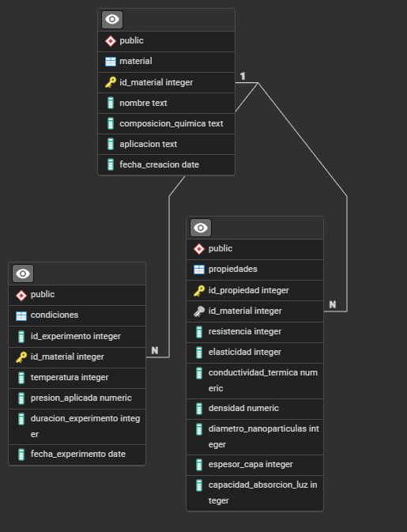

# Proyecto: Planeación de gestión de datos de nanotecnologia. 

## Contexto
En el campo de la nanotecnología, los científicos realizan experimentos sobre materiales que operan a nano escala, estos generan datos relacionados con las propiedades físicas y químicas de los materiales estudiados.

Estos datos son importantes para comprender y predecir cómo los materiales se comportan al aplicar ciertas fuerzas o condiciones, como cambios de temperatura o presión. Para poder usarlos y poder realizar predicciones precisas, es necesario el construir una estructura de datos que permita el acceso de esa información de forma optimizada.

[](https://postimg.cc/McVjMds9)

## Objetivo
El objetivo principal de este proyecto es desarrollar una plataforma de gestión de datos que facilite a los científicos acceder y analizar estos datos, impulsando así nuevas predicciones sobre el comportamiento de los materiales bajo distintas condiciones.  

## Datos

Para obtener los datos que se usaran en este proyecto se empleo la herramienta de Mockaroo. Generando 3 tablas (Materiales, propiedades, condiciones). 

La primera tabla llamada materiales incluirá campos como; un “id” (“id_material”) (integer) que será la llave principal, “nombre” (text), “composicion_quimica” (text), “aplicacion” (text), y “fecha_creacion” (date). 

Tendremos una segunda tabla llamada “condiciones”, la cual estará compuesta de un “id” (“id_experimento”) que será la llave principal (integer), “id_material” que será la llave foránea con la tabla “material” (integer), “temperatura” (integer), “presión_aplicada” (numeric), “duración_experimento” (integer), “fecha_experimento” (date).   

La tercera tabla llamada “propiedades”, estará compuesta por id (“id_propiedad”) que será la llave principal (integer), “id_material” que será la llave foránea (integer), “resistencia” (integer), “elasticidad” (integer), “conductividad_termica” (numeric), “densidad” (numeric), “diámetro_nanoparticulas” (integer), “espesor_capa” (integer), “capacidad_absorcion_luz” (integer).  



# Arquitectura de datos a emplear. 

Para este proyecto se planea emplear la arquitectura lambda, ya que, se busca el emplear datos historicos (los datos de experimentos anteriores) así como, los datos en tiempo real, recolectados mediante sensores. 

La arquitectura Lambda combina el procesamiento en Batch así como los datos en tiempo real. Para poder implementarlo, lo dividiremos en tres capas principales: 

**Capa de ingesta (Batch y Streaming)**
Batch: Para la ingesta de datos historicos("materiales.csv", "condiciones.csv" y "propiedades.csv"), se cargaran directamente a Databricks. En donde se generará una capa bronce que nos permita el integrar todos estos datos. 

Streaming: Los datos en tiempo real son capturados desde Apache Kafka. Estos son almacenados temporalmente en la capa bronce como un flujo incremental.

**Capa de procesamiento (Batch y Streaming)**
Batch: Los datos historicos son transformados y limpiados en la capa Silver. En donde se realizará el proceso de eliminación de duplicados y estandarización, etc. 

Streaming / Speed Layer: Los datos en tiempo real son procesados para poder alinearse con los datos historicos.  

**Capa de servicio (Batch y Streaming)**
Los datos procesados en las capas de batch y streaming se combinana en vistas unificadas en la capa Gold, este permite realizar ciertas predicciones. 

Al ser un proyecto que por naturaleza tiende a crecer, se planea el emplear tecnologias como "Apache Kafka" para stremaing y Databricks / Spark para batch.  
La resilencia y la tolerancia a fallos son otros dos factores claves que hacen de lambda una eficiente opcion para el proyecto. Su rendundancia inherente nos garantiza que sí una capa experimenta problemas, la otra siga funcionando. 


## Contribuciones

Este proyecto está abierto a la colaboración y agradecemos las contribuciones de la comunidad. Si deseas participar, sigue las siguientes directrices:

### ¿Cómo contribuir?

1. **Forkea el repositorio**: Crea una copia del repositorio en tu cuenta de GitHub.
2. **Clona el repositorio**: Descarga el repositorio a tu máquina local.
   ```bash
   git clone https://github.com/JaimeMoc/Plataforma_de_gestion_de_datos_de_Nanotecnologia.git

**Contacto**: 
Si tienes preguntas o necesitas orientación para comenzar, no dudes en abrir un Issue en el repositorio o enviar un correo a:

Correo: suarezjaime2712@gmail.com
Jaime Alberto Suarez Moctezuma.
¡Gracias por contribuir al avance de este proyecto de datos generados en experimentos de nanotecnología!
